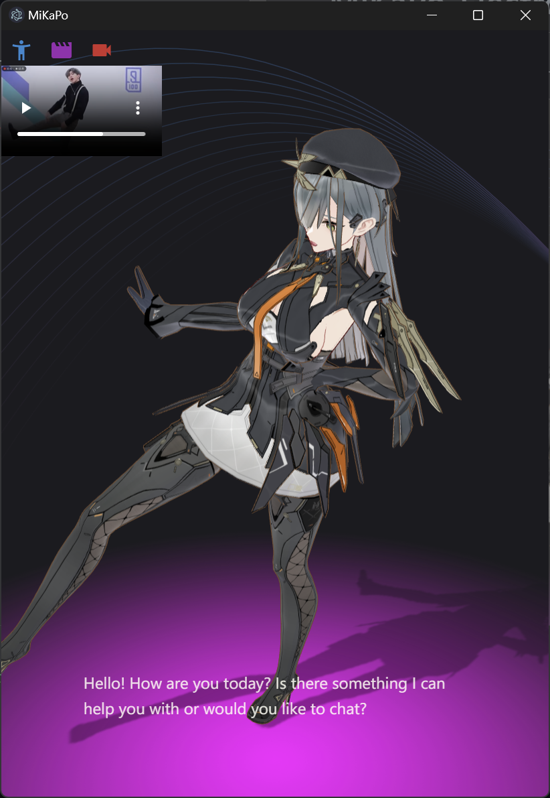

# MiKaPo-Electron

Desktop version of [MiKaPo](https://mikapo.amyang.dev), supports ollama.



## Project Setup

### Install

```bash
$ npm install
```

### Development

```bash
$ npm run dev
```

### Build

```bash
# For windows
$ npm run build:win

# For macOS
$ npm run build:mac

# For Linux
$ npm run build:linux
```
